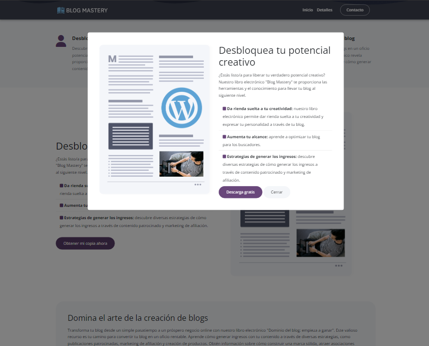

# Blog Mastery Website

Website on how to start your own blog. This website is built with Bootstrap and Sass. It uses [Font Awesome](https://fontawesome.com/) for icons.

## Features

- Responsive design
- Sticky navbar with style changes on scroll
- Bootstrap modals
- Form & input styles
- Testimonials
- Contact page with Google Map

